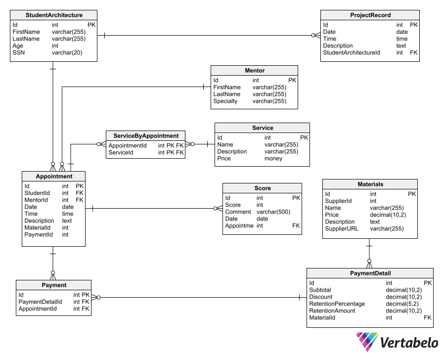

# Entidades de la base de datos: 
Base de datos: 
## Tabla: Appointment (Cita) 

Esta entidad representa una cita entre un estudiante y un mentor de arquitectura.
Atributos:
Id: Identificador único de la cita.
StudentId: Identificador del estudiante que solicita la cita.
MentorId: Identificador del mentor o asesor de arquitectura asignado a la cita.
Date: Fecha de la cita.
Time: Hora de la cita.
Description: Descripción detallada de la cita.
MaterialId: Identificador del material asociado a la cita (si aplica).
PaymentId: Identificador del detalle de pago asociado a la cita.

### Tabla: Materials (Materiales)

Esta entidad almacena información sobre los materiales utilizados en proyectos de arquitectura.
Atributos:
Id: Identificador único del material.
Name: Nombre o título del material.
Price: Precio del material.
Description: Descripción detallada del material.

### Tabla: Mentor (Mentor o Asesor)

Esta entidad representa a los mentores o asesores en arquitectura disponibles para brindar orientación a los estudiantes.
Atributos:
Id: Identificador único del mentor o asesor.
FirstName: Nombre del mentor.
LastName: Apellido del mentor.
Specialty: Especialidad o área de expertise del mentor.

### Tabla: Payment (Pago)

Esta entidad registra información sobre los pagos realizados en relación con las citas de asesoría.
Atributos:
Id: Identificador único del registro de pago.
PaymentDetailId: Identificador del detalle de pago.
AppointmentId: Identificador de la cita asociada al pago.

### Tabla: PaymentDetail (Detalle de Pago)

Esta entidad almacena detalles específicos sobre los pagos relacionados con los servicios de asesoría.
Atributos:
Id: Identificador único del detalle de pago.
Subtotal: Monto subtotal del pago.
Discount: Descuento aplicado al pago.
RetentionPercentage: Porcentaje de retención en el pago.
RetentionAmount: Monto retenido.
MaterialId: Identificador del material relacionado con el pago.

### Tabla: ProjectRecord (Registro de Proyecto)

Esta entidad registra información sobre proyectos o trabajos realizados por estudiantes de arquitectura.
Atributos:
Id: Identificador único del registro de proyecto.
Date: Fecha del registro.
Time: Hora del registro.
Description: Descripción detallada del proyecto o trabajo.
StudentArchitectureId: Identificador del estudiante de arquitectura relacionado con el proyecto.

### Tabla: Score (Puntaje)

Esta entidad registra puntajes otorgados en el contexto de las citas de asesoría.
Atributos:
Id: Identificador único del puntaje.
Score: Puntuación otorgada.
Comment: Comentario relacionado con el puntaje.
Date: Fecha del puntaje.
AppointmentId: Identificador de la cita asociada al puntaje.

### Tabla: Service (Servicio)

Esta entidad almacena información sobre los servicios de asesoría disponibles.
Atributos:
Id: Identificador único del servicio.
Name: Nombre o título del servicio.
Description: Descripción del servicio.
Price: Precio del servicio.

### Tabla: StudentArchitecture (Estudiante de Arquitectura)

Esta entidad representa a los estudiantes de arquitectura.
Atributos:
Id: Identificador único del estudiante de arquitectura.
FirstName: Nombre del estudiante.
LastName: Apellido del estudiante.
Age: Edad del estudiante.

